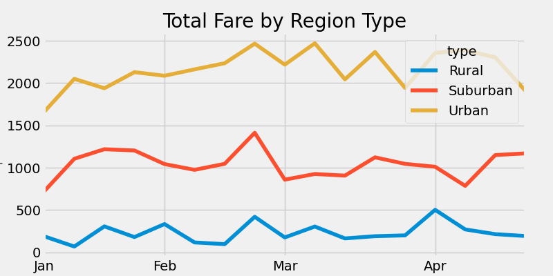

# PyBer_Analysis
## Overview
The purpose of this analysis is to analyze a data set from Pyber's ride-share data to show the difference in fares in various geographical regions via visualizations.
## Results

The table above shows that rural areas of the city are the least catered towards. Rural areas have the most expensive rides with the fewest total drivers. The surburan and urban regions of the city are much more populated by drivers and passengers making their rates lower, making the ride services more affordable.

## summary
In order to assist the Pyber company I would begin by recommending that they prioritize rural ridership by allocating more drivers to the rural areas from urban areas by assinging drivers who move between rural areas to the city. Another reocmmendation would be to priotize the rides that go between the cities and countryside with some kind of incentive so when drivers assist in improving the service. They could accomplish this by advertising said oppurtunity. If they were to raise the rates in the city per mile as well as decrease the far per mile in rural areas this should increase profits.
